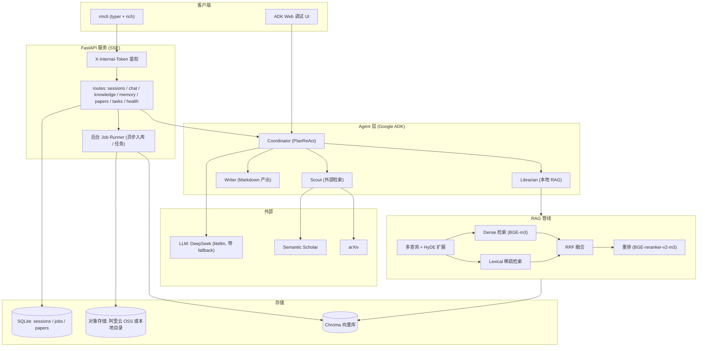

# Yz-ResearchMate

> 本地优先（local-first）的个人科研助手 —— 基于 Google ADK 的多 Agent 编排，叠加混合检索 + 重排的 RAG 引擎，对外提供 FastAPI/SSE 服务与 `rmcli` 命令行。


-000000)


ResearchMate 把"论文/课程资料/笔记"沉淀成本地知识库，再用带引用的 RAG 回答问题，并能做长期记忆、外部学术检索（arXiv / Semantic Scholar）和异步周报。所有数据默认留在本地（Chroma + SQLite + 本地对象存储目录），只有 LLM 调用走外部 API。

**技术亮点**

- **多 Agent 编排**：Coordinator（PlanReAct 规划）按意图分发给 Librarian（本地 RAG）、Scout（外部检索，内部还并行跑 arXiv / S2 两个 worker）、Writer（Markdown 产出）。
- **可调的混合 RAG**：dense（BGE-m3）+ lexical 稀疏检索 → RRF 融合 → BGE-reranker-v2-m3 重排，并支持多查询扩展（multi-query）与 HyDE，全部由 `.env` 开关与 `top_k` 参数控制。
- **评测闭环**：内置带 ground-truth 的检索评测脚本，产出 Recall / MRR / nDCG，便于"先量化再调参"，避免过拟合到单个用例。
- **生产化服务面**：FastAPI + SSE 流式对话与任务进度、`X-Internal-Token` 鉴权、后台 job runner 跑异步入库与任务、`rmcli` 全功能客户端。
- **工程规范**：`uv` 锁定依赖、ruff + black + mypy(strict)、pytest 单测、pre-commit。

---

## 目录

- [Yz-ResearchMate](#yz-researchmate)
  - [目录](#目录)
  - [系统架构](#系统架构)
  - [项目结构](#项目结构)
  - [RAG 检索流程与评测](#rag-检索流程与评测)
  - [快速开始](#快速开始)
    - [1. 安装 uv](#1-安装-uv)
    - [2. 同步依赖](#2-同步依赖)
    - [3. 配置](#3-配置)
    - [4. 验证脚手架](#4-验证脚手架)
    - [5. 导入文档](#5-导入文档)
    - [6. 用 ADK 调试 UI 提问](#6-用-adk-调试-ui-提问)
    - [7. 启动无头服务并用 CLI 对话](#7-启动无头服务并用-cli-对话)
  - [配置参考（.env）](#配置参考env)
    - [服务与鉴权](#服务与鉴权)
    - [LLM](#llm)
    - [向量与重排](#向量与重排)
    - [RAG 检索](#rag-检索)
    - [OCR 入库](#ocr-入库)
    - [存储](#存储)
    - [对象存储（阿里云 OSS，可选）](#对象存储阿里云-oss可选)
    - [记忆归档与其他](#记忆归档与其他)
  - [文档入库](#文档入库)
  - [HTTP API 参考](#http-api-参考)
  - [`rmcli` 命令参考](#rmcli-命令参考)
  - [异步任务](#异步任务)
    - [`weekly-report` — 生成 Markdown 周报](#weekly-report--生成-markdown-周报)
    - [`filter-papers` — 候选论文排序与裁剪](#filter-papers--候选论文排序与裁剪)
  - [技术栈](#技术栈)
  - [开发与测试](#开发与测试)

---

## 系统架构



| 组件 | 位置 | 职责 |
| --- | --- | --- |
| **Coordinator** | `agents/coordinator.py` | 根 Agent，用 `PlanReActPlanner` 规划，按意图把问题分发到子 Agent；持有 `search_kb` / `load_memory` / `save_preference` 工具。 |
| **Librarian** | `agents/librarian.py` | 本地 RAG 专家：回答论文事实前必须检索，结论强制带 `[source: paper_id, p.N]` 引用。 |
| **Scout** | `agents/scout.py` | 外部学术检索：内部并行跑 arXiv 与 Semantic Scholar worker，可选挂载 `arxiv-mcp-server`；外部内容一律按不可信数据处理。 |
| **Writer** | `agents/writer.py` | 把已验证证据写成 Markdown（周报 / 摘要 / 笔记），同样带引用。 |
| **检索器** | `services/retriever.py` | 混合检索 + RRF 融合 + 重排（详见下一节）。 |
| **知识库 / 解析** | `services/knowledge_base.py`、`services/parsers/` | 多格式解析、分块、入库；可选 OCR。 |
| **Job Runner** | `services/job_runner.py` | 异步入库与任务的状态机，配合 SSE 推送进度。 |
| **存储** | `services/vector_store.py`、`paper_repo.py`、`oss_client.py` | Chroma 向量库、SQLite 元数据、OSS/本地对象存储。 |

---

## 项目结构

```
src/researchmate/
├── agent.py              # ADK 入口（root_agent）
├── agents/               # Coordinator / Librarian / Scout / Writer / Memory + LLM 策略
├── api/                  # FastAPI app、路由、schema、中间件
├── cli/                  # rmcli (typer)
├── services/             # 检索、向量库、嵌入、解析器、知识库、记忆、任务、OSS、job runner
│   └── parsers/          # pdf / docx / html / markdown / txt 解析与分发
├── tools/                # ADK 工具：search_kb / load_memory / save_preference / arxiv / s2 / web_fetch
└── config.py             # pydantic-settings 配置
scripts/                  # ingest / eval_retrieval / smoke_test / backup 等运维脚本
tests/                    # pytest 单测（解析器、检索、API、记忆、任务……）
eval/                     # 评测数据集、ground-truth 与报告
examples/                 # curl 示例与样例 PDF
docs/                     # openapi、task_kinds、性能基线、demo、模板等
data/ · logs/             # 运行时数据（被 .gitignore 忽略）
```

---

## RAG 检索流程与评测

`KnowledgeRetriever.search()`（`services/retriever.py`）的处理顺序：

1. **查询扩展**（可选）：multi-query 生成 N 个改写 + HyDE 生成假设文档，扩大召回入口。
2. **双路召回**：dense（向量，默认 `top_k=20`）与 lexical 稀疏检索（默认 `top_k=20`）并行。
3. **RRF 融合**：用 Reciprocal Rank Fusion（`rrf_k=60`）把两路结果合成统一候选集，避免单一信号偏置。
4. **重排**：BGE-reranker-v2-m3 对候选做 cross-encoder 打分。
5. **截断输出**：按 `rerank_score → rrf_score` 排序，返回 `final_k`（默认 5）个片段，带 `paper_id` / 页码 / 各路 rank，供上层生成引用。

> 不安装 `rag` 可选依赖时，检索会自动降级为轻量后端（hashing 向量 + lexical 重排），便于在无 GPU / 离线环境跑通流程；安装后切换到 BGE-m3 + reranker-v2-m3。

**检索评测**（`eval/retrieval_report.json`，22 个带 ground-truth 的用例，开启 multi-query×3 + HyDE×1 + BGE 重排）：

| 指标 | 值 |
| --- | --- |
| Recall@5 | 0.8182 |
| Recall@10 | 0.8182 |
| MRR@10 | 0.6174 |
| nDCG@5 | 0.5378 |

复跑评测：

```bash
uv run python scripts/eval_retrieval.py        # 检索指标 → eval/retrieval_report.json
make eval                                       # ADK 端到端 Agent 评测
```

---

## 快速开始

### 1. 安装 uv

```bash
# Windows
winget install astral-sh.uv
# macOS / Linux
curl -LsSf https://astral.sh/uv/install.sh | sh
```

### 2. 同步依赖

```bash
uv sync                          # 基础依赖（轻量检索后端，可离线跑通）
uv sync --extra rag              # 加上 BGE-m3 向量 + reranker（需要 torch，建议有 GPU）
uv sync --extra rag --extra ocr  # 再加上扫描版 PDF 的 OCR 能力
```

### 3. 配置

```bash
cp .env.example .env
```

至少填写 `DEEPSEEK_API_KEY` 才能进行真实 LLM 对话，并把 `RESEARCH_AGENT_TOKEN` 改成一段 ≥32 字符的随机串。完整项见 [配置参考](#配置参考env)。

### 4. 验证脚手架

```bash
uv run python -c "import researchmate"
uv run rmcli --help
uv run pytest tests/
```

### 5. 导入文档

```bash
uv run python scripts/ingest.py /path/to/your-paper.pdf --paper-id paper_X --title "Paper Title"
```

更多方式（多格式 / 批量 / 重建）见 [文档入库](#文档入库)。

### 6. 用 ADK 调试 UI 提问

```bash
uv run adk web src/
```

打开输出的本地地址，选 `researchmate` app，提问例如：`What does paper_X say about its method?`

### 7. 启动无头服务并用 CLI 对话

```bash
uv run uvicorn researchmate.api:app --host 127.0.0.1 --port 8000 --workers 1
# 另开一个终端：
uv run rmcli health
uv run rmcli session create --user-id local
uv run rmcli chat "请简短说明 ResearchMate 当前能力。"
```

`rmcli` 默认读取 `.env` 里的 `RESEARCH_AGENT_BIND` 与 `RESEARCH_AGENT_TOKEN`，请求头使用 `X-Internal-Token`。也可用 `make serve` 启动服务。

---

## 配置参考（.env）

下表为代码默认值（`src/researchmate/config.py`）；`.env.example` 给出的是一套带 GPU + OCR 的示例值，可按环境调整。

### 服务与鉴权

| 变量 | 默认 | 说明 |
| --- | --- | --- |
| `RESEARCH_AGENT_BIND` | `127.0.0.1:8000` | 服务监听地址，格式 `host:port`。 |
| `RESEARCH_AGENT_TOKEN` | （必改） | 内部鉴权 token，**至少 32 字符**；CLI 与 API 用 `X-Internal-Token` 携带。 |
| `ADK_SESSION_DB_URL` | `sqlite+aiosqlite:///./data/sessions.db` | 会话库，必须是 aiosqlite URL。 |

### LLM

| 变量 | 默认 | 说明 |
| --- | --- | --- |
| `DEEPSEEK_API_KEY` | （空） | DeepSeek API key，留空则无法真实对话。 |
| `RESEARCHMATE_LLM_MODEL` | `deepseek/deepseek-chat` | 主模型（litellm 模型名）。 |
| `RESEARCHMATE_LLM_FALLBACK_MODELS` | `qwen/qwen-max,openai/gpt-4.1-mini` | 主模型失败时按序回退。 |
| `LLM_TOKEN_SOFT_LIMIT` | `200000` | 上下文软上限，超出触发裁剪。 |
| `LLM_CONTEXT_KEEP_RECENT` | `12` | 裁剪时至少保留的最近消息条数。 |

### 向量与重排

| 变量 | 默认 | 说明 |
| --- | --- | --- |
| `EMBEDDING_BACKEND` | `auto` | `auto` / `sentence-transformers` / `hashing`。 |
| `EMBEDDING_MODEL` | `BAAI/bge-m3` | 向量模型。 |
| `EMBEDDING_DEVICE` | `auto` | `auto` / `cuda` / `cpu`。 |
| `EMBEDDING_ALLOW_DOWNLOAD` | `false` | 是否允许联网下载模型权重。 |
| `EMBEDDING_BATCH_SIZE` | `16` | 编码 batch 大小（1–512）。 |
| `RERANK_BACKEND` | `auto` | `auto` / `flag` / `lexical` / `none`。 |
| `RERANKER_MODEL` | `BAAI/bge-reranker-v2-m3` | 重排模型。 |
| `RERANK_DEVICE` | `auto` | 重排设备。 |
| `RERANK_ALLOW_DOWNLOAD` | `false` | 是否允许下载重排权重。 |
| `RERANK_BATCH_SIZE` | `1` | 重排 batch 大小（1–128）。 |
| `HF_ENDPOINT` | （示例 `hf-mirror.com`） | HuggingFace 镜像，下载模型时用。 |

### RAG 检索

| 变量 | 默认 | 说明 |
| --- | --- | --- |
| `RAG_DENSE_K` | `20` | dense 召回数。 |
| `RAG_SPARSE_K` | `20` | lexical 召回数。 |
| `RAG_FINAL_K` | `5` | 重排后返回片段数。 |
| `RAG_MULTI_QUERY_ENABLED` | `true` | 是否开启多查询扩展。 |
| `RAG_MULTI_QUERY_VARIANTS` | `3` | 改写查询数（1–8）。 |
| `RAG_MULTI_QUERY_POOL_K` | `20` | 多查询合并池大小。 |
| `RAG_HYDE_ENABLED` | `true` | 是否开启 HyDE。 |
| `RAG_HYDE_DOCS` | `1` | HyDE 假设文档数（1–4）。 |
| `RAG_HYDE_POOL_K` | `20` | HyDE 合并池大小。 |

### OCR 入库

| 变量 | 默认 | 说明 |
| --- | --- | --- |
| `INGEST_OCR_ENABLED` | `false` | 入库时是否对低文本页做 OCR（需装 `ocr` extra）。 |
| `OCR_LANGUAGES` | `chi_sim+eng` | Tesseract 语言包。 |
| `OCR_DPI` | `300` | 渲染 DPI（72–600）。 |
| `OCR_MIN_CHARS` | `20` | 页面字符数低于此值才触发 OCR。 |
| `OCR_GOOD_CHARS` | `80` | OCR 结果达到此长度即视为"够好"。 |
| `OCR_MAX_PAGES` | `80` | 单文档 OCR 页数上限。 |
| `TESSERACT_CMD` | （空） | Tesseract 可执行文件路径，留空则用系统 `PATH`。 |

### 存储

| 变量 | 默认 | 说明 |
| --- | --- | --- |
| `CHROMA_DIR` | `./data/chroma` | Chroma 持久化目录。 |
| `KB_COLLECTION` | `kb_chunks` | 知识库片段集合名。 |
| `MEMORY_COLLECTION` | `memory_records` | 长期记忆集合名。 |
| `JOBS_DB_PATH` | `./data/jobs.db` | Job/任务库。 |
| `PAPERS_DB_PATH` | `./data/papers.db` | 论文元数据库。 |

### 对象存储（阿里云 OSS，可选）

未配置 OSS 时，文件存入本地 `OSS_LOCAL_DIR`，再走同一套 OSS key 流程提交入库；配置后自动切换到 OSS。

| 变量 | 默认 | 说明 |
| --- | --- | --- |
| `OSS_ACCESS_KEY_ID` / `OSS_ACCESS_KEY_SECRET` | （空） | OSS 凭证。 |
| `OSS_BUCKET` | （空） | Bucket 名。 |
| `OSS_ENDPOINT` | （空） | 如 `https://oss-cn-shenzhen.aliyuncs.com`。 |
| `OSS_LOCAL_DIR` | `./data/oss` | 未配 OSS 时的本地落盘目录。 |
| `OSS_CACHE_DIR` | `./data/cache` | 下载/生成产物缓存目录。 |

### 记忆归档与其他

| 变量 | 默认 | 说明 |
| --- | --- | --- |
| `MEMORY_IDLE_ARCHIVE_SECONDS` | `1800` | 会话空闲多久后归档进长期记忆。 |
| `MEMORY_IDLE_SCAN_SECONDS` | `300` | 空闲扫描周期。 |
| `MEMORY_MAX_SESSION_FACTS` | `8` | 单会话归档的事实条数上限。 |
| `CUDA_VISIBLE_DEVICES` | — | 限定可见 GPU。 |
| `PYTORCH_CUDA_ALLOC_CONF` | — | PyTorch 显存分配策略，如 `expandable_segments:True`。 |

---

## 文档入库

支持 PDF、`.txt`、`.md`、`.docx`、`.html` / `.htm`。

**本地直接入库**（`scripts/ingest.py`，不经过服务）：

```bash
# 单篇并指定 id/标题
uv run python scripts/ingest.py paper.pdf --paper-id paper_X --title "Paper Title"

# 多格式 / 批量
uv run python scripts/ingest.py README.md notes.txt report.docx page.html
uv run python scripts/ingest.py paper-a.pdf paper-b.pdf

# 清空并重建当前集合（谨慎）
uv run python scripts/ingest.py paper.pdf --reset
```

> `--paper-id` / `--title` 只能用于单篇文档。

**经服务入库**（先上传到 OSS/本地，再提交入库 job，并流式查看进度）：

```bash
uv run rmcli ingest examples/pdfs/rag_basics.pdf --user-id local --tag sample
uv run rmcli kb ls --user-id local
```

**扫描版 / 大量图片页 PDF**：装好 `ocr` extra 后，把 `INGEST_OCR_ENABLED=true`；入库时对文本过少的页面自动 OCR（语言、DPI、页数上限见 [OCR 配置](#ocr-入库)）。

---

## HTTP API 参考

所有 `/v1/*` 接口都需要请求头 `X-Internal-Token: <RESEARCH_AGENT_TOKEN>`。对话与任务/入库进度通过 **SSE** 流式返回。完整 schema 见 `docs/openapi.json`，调用示例见 `examples/curl/`。

| 方法 & 路径 | 说明 |
| --- | --- |
| `GET /v1/livez` | 进程存活探针。 |
| `GET /v1/readyz` | 就绪探针（依赖可用性）。 |
| `GET /v1/healthz?deep=true` | 健康检查，`deep=true` 触发一次缓存的 LLM 探活。 |
| `GET /v1/version` | 版本与运行时元数据。 |
| `POST /v1/sessions` | 创建会话。 |
| `GET/DELETE /v1/sessions/{id}` | 查询 / 删除会话。 |
| `POST /v1/chat/{session_id}` | 对话（SSE：`thinking` / `tool_call` / `tool_result` / `citation` / `token` / `final` / `error`）。 |
| `GET/POST/PATCH/DELETE /v1/memory[/{id}]` | 长期记忆增删改查。 |
| `POST /v1/memory/archive` | 把会话归档进长期记忆。 |
| `POST /v1/knowledge/ingest` | 提交入库 job（基于已上传的 `oss_keys`）。 |
| `GET /v1/knowledge/jobs/{id}` | 查询入库 job。 |
| `POST /v1/knowledge/jobs/{id}/cancel` | 取消入库 job。 |
| `GET /v1/knowledge/jobs/{id}/events` | SSE 流式入库进度。 |
| `GET /v1/knowledge/documents[/{doc_id}]` | 列出 / 删除已入库文档。 |
| `GET /v1/papers[/{paper_id}]` | 论文元数据列表 / 详情。 |
| `PATCH /v1/papers/{paper_id}` | 更新论文标签 / 已读时间 / 评分。 |
| `GET /v1/tasks/kinds` | 列出任务种类及参数 schema。 |
| `POST /v1/tasks/run` | 提交异步任务。 |
| `GET /v1/tasks/{id}` | 查询任务。 |
| `POST /v1/tasks/{id}/cancel` | 取消任务。 |
| `GET /v1/tasks/{id}/events` | SSE 流式任务进度。 |

---

## `rmcli` 命令参考

全局选项：`--base-url`（默认取 `RESEARCH_AGENT_BIND`）、`--token`（默认取 `RESEARCH_AGENT_TOKEN`）、`--version`。

| 命令 | 说明 |
| --- | --- |
| `rmcli livez` / `version` | 探活 / 版本。 |
| `rmcli health [--deep]` | 就绪检查；`--deep` 走 `/v1/healthz?deep=true`。 |
| `rmcli config` | 打印本地非敏感配置。 |
| `rmcli session create/get/delete` | 会话管理。 |
| `rmcli chat [MESSAGE] [--session-id] [--user-id]` | 单发或进入交互式对话（SSE 流式渲染）。 |
| `rmcli ingest PATH... [--tag] [--paper-id] [--title] [--wait/--no-wait]` | 上传并提交入库 job。 |
| `rmcli kb ls/rm/job/cancel/events` | 知识库文档与入库 job 管理。 |
| `rmcli memory add/ls/update/rm/archive` | 长期记忆管理（如 `--category research_direction`）。 |
| `rmcli papers ls/show/update` | 论文元数据（`--rating` / `--tag` / `--read-at`）。 |
| `rmcli task kinds/run/status/cancel` | 异步任务（见下一节）。 |

```bash
# 一些常用组合
rmcli memory add --category writing_style "先给结论，再给依据。"
rmcli papers update paper_X --rating 4.5 --tag read
rmcli kb events <job_id>
```

---

## 异步任务

通过 `POST /v1/tasks/run` 或 `rmcli task run` 提交，后台 Job Runner 执行，产物上传到 OSS/本地并写入一条 `recent_tasks` 记忆。完整契约见 `docs/task_kinds.md`。

### `weekly-report` — 生成 Markdown 周报

```bash
rmcli task run weekly-report --week 2026-W17 --paper-count 5
rmcli task run weekly-report --week-start 2026-04-20 --focus-keyword RAG --focus-keyword memory --include-external
```

| 参数 | 默认 | 说明 |
| --- | --- | --- |
| `--week` / `--week-start` | 本周一(UTC) | 二选一；`--week 2026-W17` 自动换算成周一日期。 |
| `--paper-count` | `5` | 入选论文数（1–20）。 |
| `--focus-keyword` | `[]` | 可多次传入，用于本地排序与可选外部检索。 |
| `--include-external` / `--local-only` | 本地 | 是否纳入 arXiv / S2 候选。 |

### `filter-papers` — 候选论文排序与裁剪

```bash
rmcli task run filter-papers --query "RAG agent shortlist" --top-n 50
```

| 参数 | 默认 | 说明 |
| --- | --- | --- |
| `--query` | 必填 | 相关性目标，用于打分与逐轮 query 精化。 |
| `--candidate-paper-id` | `[]` | 可多次传入；为空则从本地论文历史加载。 |
| `--top-n` | `50` | 保留数量（1–200）。 |
| `--max-iter` | `3` | 打分→裁剪下半→精化 query 的轮数（1–10）。 |

> **外部检索策略**：默认只用 arXiv + Semantic Scholar；Google Scholar 无官方 API、抓取易被封，暂不直接抓取，必要时可接入 SerpAPI。Scout 也支持可选挂载 `arxiv-mcp-server`（存在即注册，缺失则回退到内置 arXiv 工具）。

---

## 技术栈

- **Agent**：Google ADK（`LlmAgent` / `ParallelAgent` / `PlanReActPlanner`）
- **LLM 接入**：litellm（DeepSeek 主模型 + 多模型 fallback）
- **检索**：Chroma 向量库、BGE-m3（sentence-transformers）、BGE-reranker-v2-m3（FlagEmbedding）、RRF 融合
- **解析 / OCR**：pdfplumber、python-docx、trafilatura、markdown-it-py；PyMuPDF + pytesseract（可选）
- **服务**：FastAPI、uvicorn、sse-starlette、SQLAlchemy + aiosqlite
- **CLI**：typer + rich + httpx
- **外部检索**：arxiv、semanticscholar、（可选）arxiv-mcp-server
- **工程**：uv、ruff、black、mypy(strict)、pytest、pre-commit

---

## 开发与测试

```bash
make test        # uv run pytest tests/
make lint        # ruff check + black --check + mypy
make format      # black + ruff --fix
make serve       # 启动本地服务
make smoke-m5    # 端到端 smoke（steps 1-6）
make eval        # ADK 端到端评测
make backup      # 备份本地数据
uv run python scripts/eval_retrieval.py   # 检索指标评测
uv run pre-commit run --all-files          # 提交前全量检查
```
